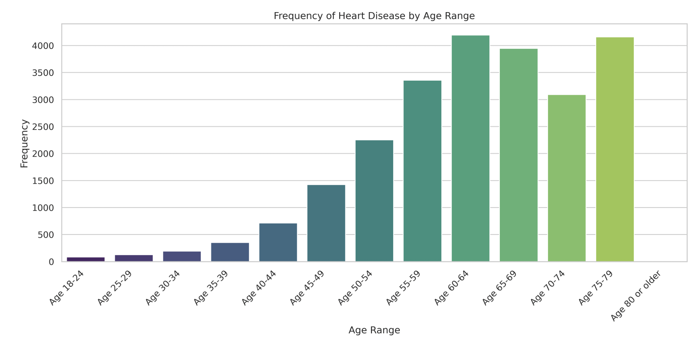
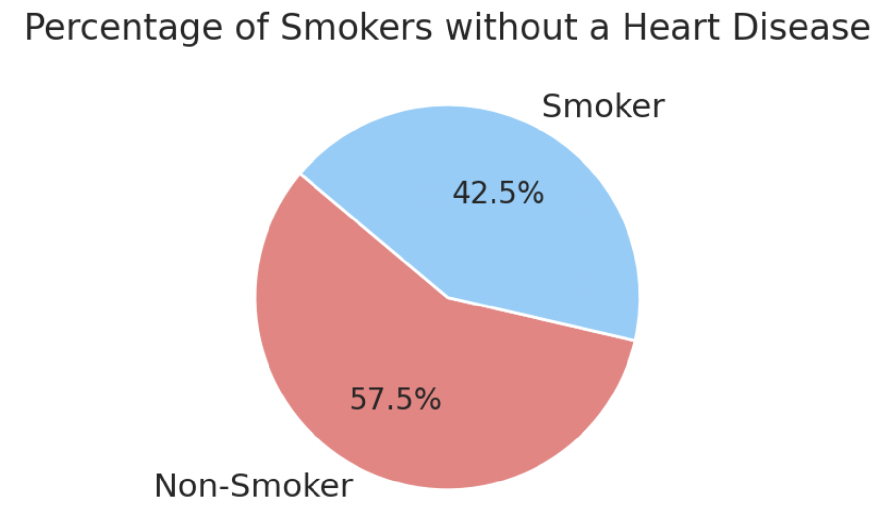
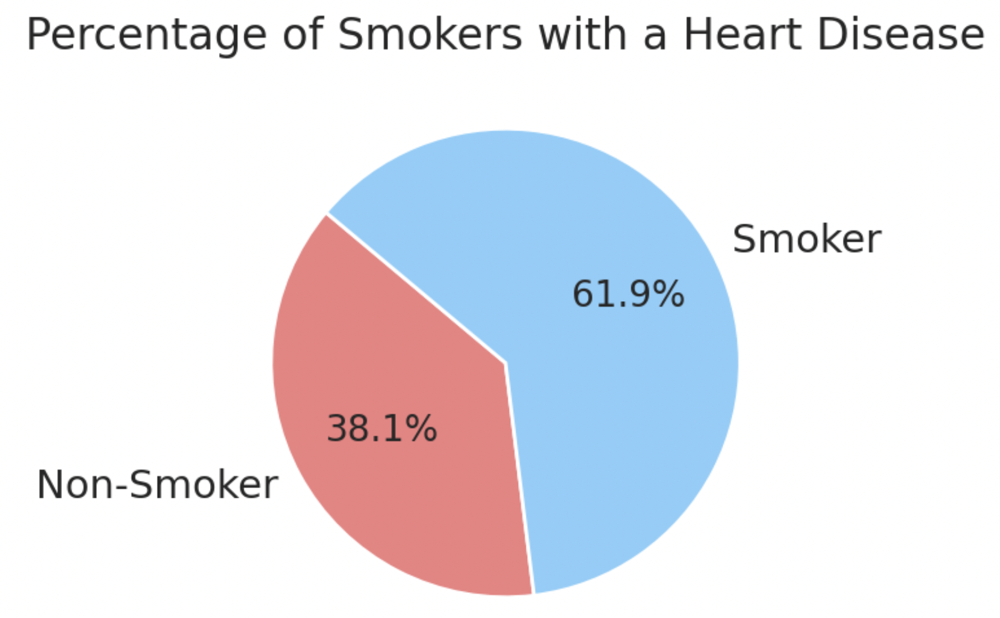
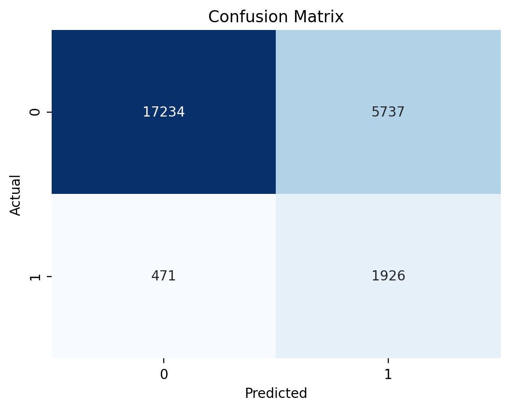
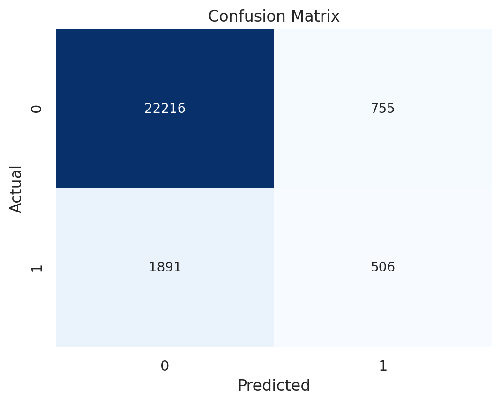
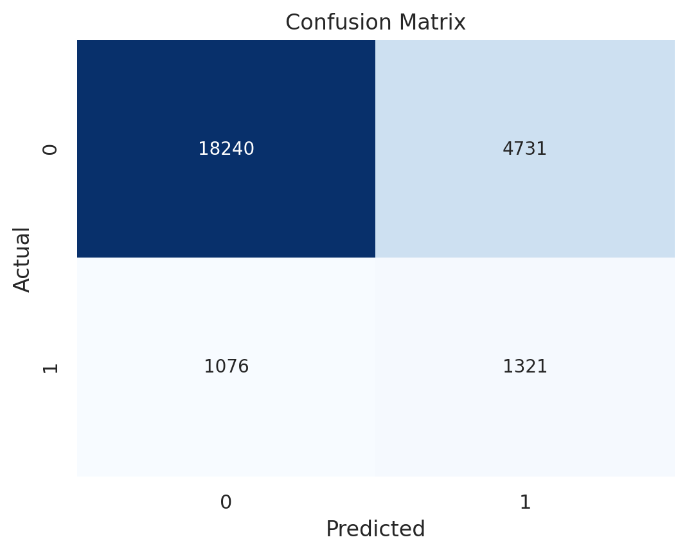

# Heart Disease Indicator Analysis

## 1. Introduction

**Objective:** Explore possible indicators for heart diseases.

**Questions:**
1. Which age range are you most likely to have heart issues?
2. Do the smoking habits differ between people with and without heart issues?
3. Which machine learning model among LogisticRegression, RandomForestClassifier, XGBClassifier, KNeighborsClassifier is the most suitable for predicting heart issues?

## 2. Selection of Datasets

**DataSet:** 'Heart Disease Health Indicators Dataset' from Kaggle.

**Data:**
- [Heart Disease Health Indicators Dataset](https://www.kaggle.com/datasets/alexteboul/heart-disease-health-indicators-dataset)
    - This is a cleaned and filtered dataset that is specific to heart disease in 2015. 
    - 253,680 survey responses from cleaned BRFSS 2015 dataset.
    - Optimized for binary classifications for heart disease. '
    - Strong class imbalance. 
        - 229,787 people have not had heart disease while 23,893 have had heart disease.

- Original Dataset [Behavioral Risk Factor Surveillance System](https://www.kaggle.com/datasets/cdc/behavioral-risk-factor-surveillance-system)
    - Collected by Center for Disease and Prevention

## 3. Methodologies

### 3.1. Data Import and Cleaning

- Use Pandas to:
  - Filter dataset.
  - Apply `groupby()` method for grouping certain rows based on a value of another column 
- Use Matplotlib and seaborn for visualization.

### 3.2. Machine Learning Models

- For Q3, "Which machine learning model among LogisticRegression, RandomForestClassifier, XGBClassifier, KNeighborsClassifier is the most suitable for predicting heart issues?"
- Sklearn models below were picked based on their suitability for binary classifications:

#### 3.2.1. Logistic Regression

- Nature: Logistic Regression models the probability that a given instance belongs to a particular class.
- Use Case for Binary: Ideal for binary classification tasks.
- Strengths for Binary: Well-suited for linear relationships, provides interpretable coefficients, and outputs probabilities.
- Considerations: Assumes a linear relationship between features and log-odds, which might limit its ability to analyze non-linear patterns.

#### 3.2.2. RandomForestClassifier

- Nature: RandomForestClassifier is a group of decision trees that work together to make predictions.
- Use Case for Binary: Effective for binary classification tasks due to its ability to capture complex non-linear relationships.
- Strengths for Binary: Robust, handles feature interactions well, and can deal with imbalanced datasets.
- Considerations: Computationally intensive for large datasets, and the interpretability of the individual trees may be limited.

#### 3.2.3. XGBClassifier (XGBoost)

- Nature: Gradient boosting framework that builds a group of weak learners.
- Use Case for Binary: Well-suited for binary classification tasks and often outperforms other algorithms.
- Strengths for Binary: High predictive performance, handles non-linear relationships well, and includes regularization to prevent overfitting.
- Considerations: May require tuning of hyperparameters.

#### 3.2.4. KNeighborsClassifier

- Nature: Classifications of instances based on the majority class of their k-nearest neighbors.
- Use Case for Binary: Suitable for binary classification tasks, especially when local patterns in the data are important.
- Strengths for Binary: Simple conceptually, non-linear relationships are implicitly captured.
- Considerations: Sensitive to the choice of k, computationally expensive for large datasets, and may not perform well in high-dimensional spaces.

### 3.3. Dataset Division:

  - Train (90%) and test (10%) subsets.
  - Input and output sets.
    - Input: ['HighBP,	HighChol,	CholCheck,	BMI,	Smoker,	Stroke,	Diabetes,	PhysActivity,	HvyAlcoholConsump,	AnyHealthcare,	NoDocbcCost,	GenHlth	MentHlth,	PhysHlth,	DiffWalk,	Sex,	Age']
        - Columns used for the input set are chosen based on information that is commonly asked or measured at doctor's visits. 
        - Columns that are ignored are ['Fruits', 'Veggies', 'Education', 'Income']
    - Output: ['HeartDiseaseorAttack']
  
### 3.4. Handling Imbalance: 

- **SMOTE (Synthetic Minority Over-sampling Technique):**
    - addresses class imbalance in binary classification tasks.
    - designed for the minority class, SMOTE generates synthetic. 
    - By introducing synthetic examples, SMOTE helps balance class distribution, enhancing the model's ability to learn from the minority class and improving overall classification performance. 
        
### 3.5. Evaluation Metrics with report:

The classification report provides performance metrics for a binary classification model. Each row represents a class (0 or 1), and the columns include precision, recall, and F1-score. 

- **Precision:** The ratio of true positive predictions to the total predicted positives, indicating the accuracy of positive predictions.
- **Recall:** The ratio of true positive predictions to the total actual positives, measuring the model's ability to capture all positive instances.
- **F1-score:** The harmonic mean of precision and recall, offering a balanced assessment of a model's performance.

### 3.6. Visualization with Confusion Matrix

A confusion matrix is a table that provides a detailed summary of the performance of a classification model. It compares predicted labels against actual labels, categorizing instances into four outcomes:

- **True Positive (TP):** Instances correctly predicted as positive.
- **True Negative (TN):** Instances correctly predicted as negative.
- **False Positive (FP):** Instances incorrectly predicted as positive.
- **False Negative (FN):** Instances incorrectly predicted as negative.

## 4. Results
- [Code](https://www.kaggle.com/datasets/alexteboul/heart-disease-health-indicators-dataset)
- **Disclaimer**: To run the code, go to Kernal -> Restart & Run All. It will take about 5 minutes for all the machine learning models to run 

### 4.1. Which age range are you most likely to have heart issues?

### 4.2. Do the smoking habits differ between people with and without heart issues?

#### 4.2.1. How many people with a heart disease smoke?

#### 4.2.2. How many people without a heart disease smoke?

### 4.3. Can we accurately predict the anxiety, depression, and insomnia level based on their music taste or frequency using machine learning models?

#### 4.3.1. LogisticRegressor

**Accuracy:  0.7552822453484705 -> approximately 76%**
- The classification report below presents a detailed assessment of a binary classification model. While achieving high precision for the '0.0' class, the model shows lower recall, suggesting some instances are overlooked. On the other hand, for the '1.0' class, the model has higher recall but at the expense of precision, resulting in a trade-off between false positives and false negatives. The overall model accuracy is 76%.

  **Classification Report for LogisticRegressor:**

|              | Precision | Recall | F1-Score | Support |
|--------------|-----------|--------|----------|---------|
| 0.0          | 0.97      | 0.75   | 0.85     | 22971   |
| 1.0          | 0.25      | 0.80   | 0.38     | 2397    |
| **Accuracy** |           |        | 0.76     | 25368   |
| **Macro Avg**| 0.61      | 0.78   | 0.62     | 25368   |
| **Weighted Avg** | 0.91   | 0.76   | 0.80     | 25368   |

#### 4.3.2. XBGClassifier

**Accuracy:  0.8956953642384106 -> approximately 90%**

- The classification report below presents a detailed assessment of a binary classification model. While achieving high precision for the '0.0' class, the model shows lower recall, suggesting some instances are overlooked. On the other hand, for the '1.0' class, the model has higher recall but at the expense of precision, resulting in a trade-off between false positives and false negatives. The overall model accuracy is 76%.

**Classification Report for XBGClassifier:**
-  For the '0.0' class, the model demonstrates high precision (0.92) and recall (0.97), resulting in a F1-score of 0.94. However, for the '1.0' class, precision is lower (0.40) with a modest recall (0.21), leading to a F1-score of 0.28. The overall accuracy of the model is 90%.
  

|              | Precision | Recall | F1-Score | Support |
|--------------|-----------|--------|----------|---------|
| 0.0          | 0.92      | 0.97   | 0.94     | 22971   |
| 1.0          | 0.40      | 0.21   | 0.28     | 2397    |
| **Accuracy** |           |        | 0.90     | 25368   |
| **Macro Avg**| 0.66      | 0.59   | 0.61     | 25368   |
| **Weighted Avg** | 0.87   | 0.90   | 0.88     | 25368   |

#### 4.3.3. Kth Neareast Neighbors
**Accuracy:  0.7710895616524756 -> approximately 77%**
- The model achieves a high precision of 0.94 for the '0.0' class, with a lower recall of 0.79. Additionally, the '1.0' class has a lower precision (0.22) but a higher recall (0.55), leading to a F1-score of 0.31. The overall accuracy of the model is 77%. 

**Classification Report for Kth Neareast Neighbors:**

|              | Precision | Recall | F1-Score | Support |
|--------------|-----------|--------|----------|---------|
| 0.0          | 0.94      | 0.79   | 0.86     | 22971   |
| 1.0          | 0.22      | 0.55   | 0.31     | 2397    |
| **Accuracy** |           |        | 0.77     | 25368   |
| **Macro Avg**| 0.58      | 0.67   | 0.59     | 25368   |
| **Weighted Avg** | 0.88   | 0.77   | 0.81     | 25368   |

